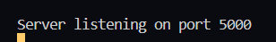

<h1 align ="center">Rest API</h1>

 <h3  align ="center"><b>Rest API in ReactJs & It is running on port 5000</b></h3>
  

It is Rest API in ReactJs,REST API (Representational State Transfer API) is a way to communicate with a web server to fetch or modify data.

